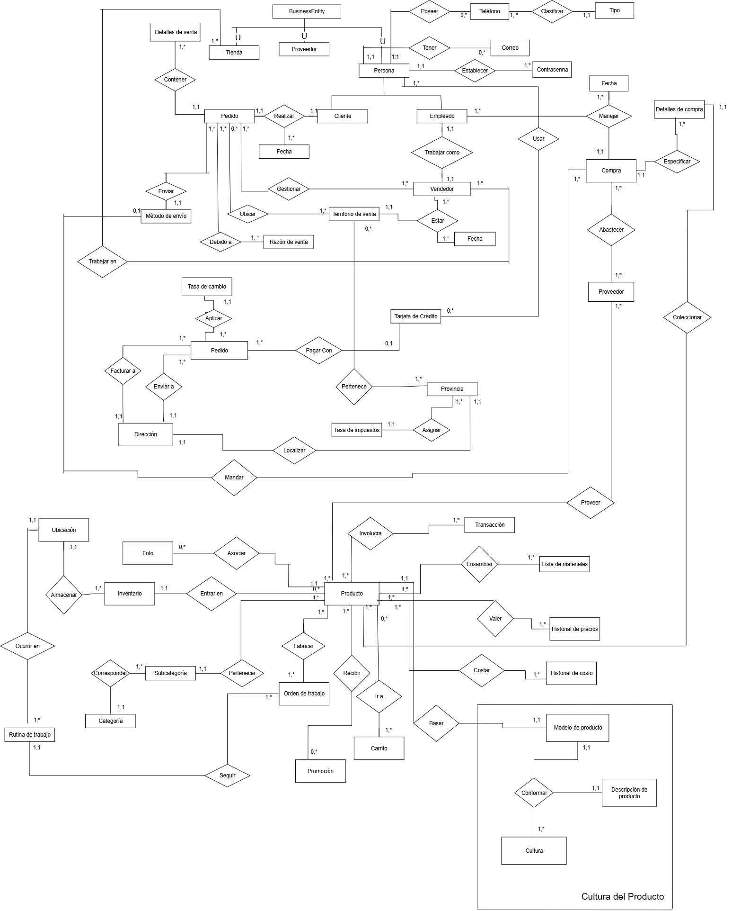
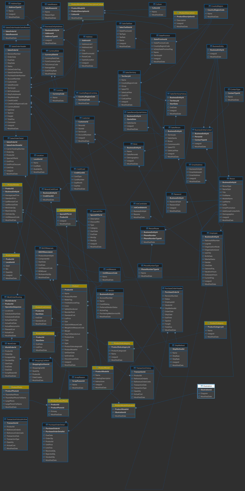

# AdventureWorks Core

## Resumen

AdventureWorks Core representa la base de datos referente a toda la dinámica de la empresa AdventureWorks. En esta se distinguen  varios dominios que abarcan un conjunto de entidades e interrelaciones, entre ellas : Ventas, Compras, Productos, Entidades comerciales, Envíos, Ubicaciones, entre ellos. Todos estos dominios serán analizados detalladamente en esta documentación.

## Modelo conceptual

## Modelo lógico

## Catálogo de datos

### Address

Dirección asociada a la dirección de una persona.

| Campo            | Tipo de dato        | Restricciones               | Clave     | Descripción                                      |
|------------------|---------------------|-----------------------------|-----------|--------------------------------------------------|
| AddressID        | INT                 | NOT NULL                    | PK        | Identificador único de la dirección              |
| AddressLine1     | NVARCHAR(60)        | NOT NULL                    | —         | Línea principal de la dirección                  |
| AddressLine2     | NVARCHAR(60)        | NULL                        | —         | Línea secundaria (opcional)                      |
| City             | NVARCHAR(30)        | NOT NULL                    | —         | Ciudad                                           |
| StateProvinceID  | INT                 | NOT NULL                    | FK        | Referencia a la provincia o estado               |
| PostalCode       | NVARCHAR(15)        | NOT NULL                    | —         | Código postal                                    |
| SpatialLocation  | GEOGRAPHY           | NULL                        | —         | Coordenadas geográficas.              |
| rowguid          | UNIQUEIDENTIFIER    | NOT NULL, UNIQUE            | —         | Identificador global único                       |
| ModifiedDate     | DATETIME            | NOT NULL                    | —         | Fecha de última modificación        |

### AdressType

Define el tipo de dirección asociada a una entidad.

| Campo | Tipo de Dato | Clave | Restricciones                   Descripción |
|---------------------|--------------|-------|-------------|
| AddressTypeID       | int          | PK    |NOT NULL, UNIQUE | Identificador único del tipo de dirección |
| Name                | nvarchar(50) |       | NOT NULL        | Nombre del tipo de dirección(de envío, facturación, etc) |
|rowguid              | uniqueidentifier|       |NOT NULL, UNIQUE       |Identificador único del registro |
| ModifiedDate        | datetime     |       | NOT NULL         |Fecha de última modificación |

### BillOfMaterials

Contiene la lista de materiales o componentes necesarios para la confección o ensamblaje de un producto.

| Campo | Tipo de Dato     | Clave | Restricciones                  | Descripción |
|---------------------|------------------|-------|--------------------------------|-------------|
| BillOfMaterialsID   | int              | PK    | NOT NULL, UNIQUE               | Identificador único del registro de lista de materiales |
| ProductAssemblyID   | int              | FK    | NOT NULL                       | Producto ensamblado  |
| ComponentID         | int              | FK    | NOT NULL                       | Componente utilizado  |
| StartDate           | datetime         |       | NOT NULL                       | Fecha de inicio |
| EndDate             | datetime         |       | NULLABLE                       | Fecha de fin  |
| UnitMeasureCode     | nchar(3)         |       | NOT NULL                       | Unidad de medida del componente |
| BOMLevel            | smallint         |       | NOT NULL                       | Nivel jerárquico dentro del ensamblaje |
| PerAssemblyQty      | decimal(8,2)     |       | NOT NULL, DEFAULT 1.00         | Cantidad por ensamblaje |
| ModifiedDate        | datetime         |       | NOT NULL                       | Fecha de última modificación |

### BusinessEntity

Representa una entidad comercial de forma genérica(puede ser persona, proveedor, etc.)

| Campo | Tipo de Dato       | Clave | Restricciones                  | Descripción |
|---------------------|--------------------|-------|--------------------------------|-------------|
| BusinessEntityID    | int                | PK    | NOT NULL, UNIQUE               | Identificador único de la entidad comercial |
| rowguid             | uniqueidentifier   |       | NOT NULL, UNIQUE, DEFAULT NEWID() | Identificador global único |
| ModifiedDate        | datetime           |       | NOT NULL                       | Fecha de última modificación |

### BusinessEntityAddress

Dirección asociada a la entidad comercial.

| Campo | Tipo de Dato       | Clave | Restricciones                  | Descripción |
|---------------------|--------------------|-------|--------------------------------|-------------|
| BusinessEntityID    | int                | PK, FK| NOT NULL                       | Entidad comercial asociada |
| AddressID           | int                | PK, FK| NOT NULL                       | Dirección asociada |
| AddressTypeID       | int                | FK    | NOT NULL                       | Tipo de dirección |
| rowguid             | uniqueidentifier   |       | NOT NULL, UNIQUE, DEFAULT NEWID() | Identificador global único |
| ModifiedDate        | datetime           |       | NOT NULL                       | Fecha de última modificación |

### BusinessEntityContact

Representa la relación entre una entidad comercial y una persona de contacto.

| Campo | Tipo de Dato       | Clave | Restricciones                  | Descripción |
|---------------------|--------------------|-------|--------------------------------|-------------|
| BusinessEntityID    | int                | PK, FK| NOT NULL                       | Entidad asociada |
| PersonID            | int                | PK, FK| NOT NULL                       | Persona de contacto |
| ContactTypeID       | int                | FK    | NOT NULL                       | Tipo de contacto |
| rowguid             | uniqueidentifier   |       | NOT NULL, UNIQUE, DEFAULT NEWID() | Identificador global único |
| ModifiedDate        | datetime           |       | NOT NULL                       | Fecha de última modificación |

### ContactType

Clasifica el tipo de relación que una persona tiene con una entidad comercial.

| Campo           | Tipo de Dato     | Clave | Restricciones                  | Descripción |
|-----------------|------------------|-------|--------------------------------|-------------|
| ContactTypeID   | int              | PK    | NOT NULL, UNIQUE               | Identificador único del tipo de contacto |
| Name            | nvarchar(50)     |       | NOT NULL                       | Tipo de contacto |
| ModifiedDate    | datetime         |       | NOT NULL                       | Fecha de última modificación |

### CountryRegion

Contiene los países y regiones usadas en las direcciones.

| Campo           | Tipo de Dato     | Clave | Restricciones                  | Descripción |
|-----------------|------------------|-------|--------------------------------|-------------|
| CountryRegionCode | nvarchar(3)    | PK    | NOT NULL, UNIQUE               | Código de país o región |
| Name            | nvarchar(50)     |       | NOT NULL                       | Nombre del país o región |
| ModifiedDate    | datetime         |       | NOT NULL                       | Fecha de última modificación |

### CountryRegionCurrency

Contiene la relación de las monedas que se usan en cada región o país.

| Campo             | Tipo de Dato     | Clave     | Restricciones                  | Descripción |
|-------------------|------------------|-----------|--------------------------------|-------------|
| CountryRegionCode | nvarchar(3)      | PK, FK    | NOT NULL                       | País o región asociada |
| CurrencyCode      | nchar(3)         | PK, FK    | NOT NULL                       | Código de moneda asociada |
| ModifiedDate      | datetime         |           | NOT NULL                       | Fecha de última modificación |

### CreditCard

Tarjetas de crédito utilizadas por contactos o clientes.

| Campo         | Tipo de Dato       | Clave | Restricciones                  | Descripción |
|---------------|--------------------|-------|--------------------------------|-------------|
| CreditCardID  | int                | PK    | NOT NULL, UNIQUE               | Identificador único de la tarjeta |
| CardType      | nvarchar(50)       |       | NOT NULL                       | Tipo de tarjeta  |
| CardNumber    | nvarchar(25)       |       | NOT NULL, UNIQUE               | Número de tarjeta |
| ExpMonth      | tinyint            |       | NOT NULL, BETWEEN 1 AND 12     | Mes de expiración |
| ExpYear       | smallint           |       | NOT NULL, >= Año actual        | Año de expiración |
| ModifiedDate  | datetime           |       | NOT NULL                       | Fecha de última modificación |

### Culture

Define culturas utilizadas para localización y traducción de datos.

| Campo         | Tipo de Dato     | Clave | Restricciones                  | Descripción |
|---------------|------------------|-------|--------------------------------|-------------|
| CultureID     | nchar(6)         | PK    | NOT NULL, UNIQUE               | Identificador de cultura |
| Name          | nvarchar(50)     |       | NOT NULL                       | Descripción de cultura |
| ModifiedDate  | datetime         |       | NOT NULL                       | Fecha de última modificación |

### Currency

Define monedas utilizadas en transacciones y relaciones internacionales.

| Campo         | Tipo de Dato     | Clave | Restricciones                  | Descripción |
|---------------|------------------|-------|--------------------------------|-------------|
| CurrencyCode  | nchar(3)         | PK    | NOT NULL, UNIQUE               | Código de moneda |
| Name          | nvarchar(50)     |       | NOT NULL                       | Nombre de la moneda |
| ModifiedDate  | datetime         |       | NOT NULL                       | Fecha de última modificación |

### CurrencyRate

Define las tasas de cambio entre monedas en fechas específicas.

| Campo         | Tipo de Dato     | Clave     | Restricciones                  | Descripción |
|---------------|------------------|-----------|--------------------------------|-------------|
| CurrencyRateID| int              | PK        | NOT NULL, UNIQUE               | Identificador único de la tasa |
| CurrencyRateDate | datetime      |           | NOT NULL                       | Fecha de la tasa de cambio |
| FromCurrencyCode | nchar(3)      | FK        | NOT NULL                       | Moneda de origen |
| ToCurrencyCode   | nchar(3)      | FK        | NOT NULL                       | Moneda de destino |
| AverageRate      | money         |           | NOT NULL, > 0                  | Tasa promedio |
| EndOfDayRate     | money         |           | NOT NULL, > 0                  | Tasa de cierre |
| ModifiedDate     | datetime      |           | NOT NULL                       | Fecha de última modificación |

### Customer

Representa clientes individuales o corporativos.

| Campo           | Tipo de Dato     | Clave | Restricciones                  | Descripción |
|-----------------|------------------|-------|--------------------------------|-------------|
| CustomerID      | int              | PK    | NOT NULL, UNIQUE               | Identificador único del cliente |
| PersonID        | int              | FK    | NULLABLE                       | Referencia a persona |
| StoreID         | int              | FK    | NULLABLE                       | Referencia a tienda|
| TerritoryID     | int              | FK    | NULLABLE                       | Región de ventas asociada |
| AccountNumber   | varchar(10)      |       | NOT NULL, UNIQUE               | Número de cuenta del cliente |
| rowguid         | uniqueidentifier |       | NOT NULL, UNIQUE, DEFAULT NEWID() | Identificador global único |
| ModifiedDate    | datetime         |       | NOT NULL                       | Fecha de última modificación |

### EmailAddress

Correo electrónicos asociados a las personas.

| Campo         | Tipo de Dato     | Clave | Restricciones                  | Descripción |
|---------------|------------------|-------|--------------------------------|-------------|
| BusinessEntityID | int           | PK, FK| NOT NULL                       | Persona asociada |
| EmailAddressID   | int           | PK    | NOT NULL, UNIQUE               | Identificador de la dirección |
| EmailAddress      | nvarchar(50) |       | NOT NULL, UNIQUE               | Dirección de correo electrónico |
| rowguid           | uniqueidentifier |   | NOT NULL, UNIQUE, DEFAULT NEWID() | Identificador global único |
| ModifiedDate      | datetime     |       | NOT NULL                       | Fecha de última modificación |

### Employee

Empleados de la compannía.

| Campo           | Tipo de Dato     | Clave | Restricciones                  | Descripción |
|-----------------|------------------|-------|--------------------------------|-------------|
| BusinessEntityID| int              | PK, FK| NOT NULL                       | Identificador del empleado |
| NationalIDNumber| nvarchar(15)     |       | NOT NULL, UNIQUE               | Número de identificación nacional |
| LoginID         | nvarchar(256)    |       | NOT NULL, UNIQUE               | Credencial de acceso |
| JobTitle        | nvarchar(50)     |       | NOT NULL                       | Título del puesto |
| BirthDate       | date             |       | NOT NULL                       | Fecha de nacimiento |
| MaritalStatus   | nchar(1)         |       | NOT NULL, IN ('S','M')         | Estado civil |
| Gender          | nchar(1)         |       | NOT NULL, IN ('M','F')         | Género |
| HireDate        | date             |       | NOT NULL                       | Fecha de contratación |
| SalariedFlag    | bit              |       | NOT NULL                       | Indica si el empleado es asalariado |
| VacationHours   | smallint         |       | NOT NULL, >= 0                 | Horas de vacaciones acumuladas |
| SickLeaveHours  | smallint         |       | NOT NULL, >= 0                 | Horas de licencia médica acumuladas |
| CurrentFlag     | bit              |       | NOT NULL, DEFAULT 1            | Indica si el empleado está activo|
| rowguid         | uniqueidentifier |       | NOT NULL, UNIQUE, DEFAULT NEWID() | Identificador global único |
| ModifiedDate    | datetime         |       | NOT NULL                       | Fecha de última modificación |

### Ilustration

Contenido gráfico asociado a productos.

| Campo         | Tipo de Dato     | Clave | Restricciones                  | Descripción |
|---------------|------------------|-------|--------------------------------|-------------|
| IllustrationID| int              | PK    | NOT NULL, UNIQUE               | Identificador único de la ilustración |
| Diagram       | xml              |       | NULLABLE                       | Contenido gráfico en formato XML |
| ModifiedDate  | datetime         |       | NOT NULL                       | Fecha de última modificación |

### JobCandidate

Personas candidatas a empleo.

| Campo           | Tipo de Dato     | Clave | Restricciones                  | Descripción |
|-----------------|------------------|-------|--------------------------------|-------------|
| JobCandidateID  | int              | PK    | NOT NULL, UNIQUE               | Identificador del candidato |
| BusinessEntityID| int              | FK    | NULLABLE                       | Referencia a empleado (si aplica) |
| Resume          | xml              |       | NULLABLE                       | Currículum  |
| ModifiedDate    | datetime         |       | NOT NULL                       | Fecha de última modificación |

### Location

Áreas físicas dentro de una unidad de producción.

| Campo         | Tipo de Dato     | Clave | Restricciones                  | Descripción |
|---------------|------------------|-------|--------------------------------|-------------|
| LocationID    | smallint         | PK    | NOT NULL, UNIQUE               | Identificador de la ubicación |
| Name          | nvarchar(50)     |       | NOT NULL                       | Nombre de la ubicación |
| CostRate      | smallmoney       |       | NOT NULL, >= 0                 | Tasa de costo asociada |
| Availability  | decimal(8,2)     |       | NOT NULL, BETWEEN 0 AND 100    | Porcentaje de disponibilidad |
| ModifiedDate  | datetime         |       | NOT NULL                       | Fecha de última modificación |

### Password

Contraseñas asociadas a personas para autenticación.

| Campo           | Tipo de Dato     | Clave | Restricciones                  | Descripción |
|-----------------|------------------|-------|--------------------------------|-------------|
| BusinessEntityID| int              | PK, FK| NOT NULL                       | Persona asociada |
| PasswordHash    | varchar(128)     |       | NOT NULL                       | Hash de la contraseña |
| PasswordSalt    | varchar(10)      |       | NOT NULL                       | Sal para el hash |
| rowguid         | uniqueidentifier |       | NOT NULL, UNIQUE, DEFAULT NEWID() | Identificador global único |
| ModifiedDate    | datetime         |       | NOT NULL                       | Fecha de última modificación |

### Person

Representa individuos que pueden ser empleados, contactos, clientes o candidatos.

| Campo             | Tipo de Dato       | Clave | Restricciones                          | Descripción |
|-------------------|--------------------|-------|----------------------------------------|-------------|
| BusinessEntityID  | int                | PK, FK| NOT NULL                               | Identificador único de la persona |
| PersonType        | nchar(2)           |       | NOT NULL, IN ('EM','SP','SC','IN','VC','GC') | Tipo de persona |
| NameStyle         | bit                |       | NOT NULL, DEFAULT 0                    | Estilo de nombre |
| Title             | nvarchar(8)        |       | NULLABLE                               | Título honorífico |
| FirstName         | nvarchar(50)       |       | NOT NULL                               | Primer nombre |
| MiddleName        | nvarchar(50)       |       | NULLABLE                               | Segundo nombre |
| LastName          | nvarchar(50)       |       | NOT NULL                               | Apellido |
| Suffix            | nvarchar(10)       |       | NULLABLE                               | Sufijo del nombre |
| EmailPromotion    | int                |       | NOT NULL, DEFAULT 0                    | Nivel de promoción por correo |
| AdditionalContactInfo | xml           |       | NULLABLE                               | Información adicional de contacto |
| Demographics      | xml                |       | NULLABLE                               | Datos demográficos |
| rowguid           | uniqueidentifier   |       | NOT NULL, UNIQUE, DEFAULT NEWID()      | Identificador global único |
| ModifiedDate      | datetime           |       | NOT NULL                               | Fecha de última modificación |

### PersonCreditCard

Relación entre personas y sus tarjetas de crédito.

| Campo             | Tipo de Dato     | Clave | Restricciones                  | Descripción |
|-------------------|------------------|-------|--------------------------------|-------------|
| BusinessEntityID  | int              | PK, FK| NOT NULL                       | Persona asociada |
| CreditCardID      | int              | PK, FK| NOT NULL                       | Tarjeta de crédito asociada |
| ModifiedDate      | datetime         |       | NOT NULL                       | Fecha de última modificación |

### PersonPhone

Representa la asociación entre personas y sus números telefónicos.

| Campo             | Tipo de Dato     | Clave | Restricciones                  | Descripción |
|-------------------|------------------|-------|--------------------------------|-------------|
| BusinessEntityID  | int              | PK, FK| NOT NULL                       | Persona asociada |
| PhoneNumber       | nvarchar(25)     | PK    | NOT NULL                       | Número telefónico |
| PhoneNumberTypeID | int              | PK, FK| NOT NULL                       | Tipo de número |
| ModifiedDate      | datetime         |       | NOT NULL                       | Fecha de última modificación |

### PhoneNumberType

Tipos de números de teléfono.

| Campo             | Tipo de Dato     | Clave | Restricciones                  | Descripción |
|-------------------|------------------|-------|--------------------------------|-------------|
| PhoneNumberTypeID | int              | PK    | NOT NULL, UNIQUE               | Identificador del tipo de número |
| Name              | nvarchar(50)     |       | NOT NULL                       | Nombre del tipo de número |
| ModifiedDate      | datetime         |       | NOT NULL                       | Fecha de última modificación |

### Product

Productos vendidos o usados en la manufactura de productos vendidos.

| Campo             | Tipo de Dato     | Clave | Restricciones                          | Descripción |
|-------------------|------------------|-------|----------------------------------------|-------------|
| ProductID         | int              | PK    | NOT NULL, UNIQUE                       | Identificador del producto |
| Name              | nvarchar(50)     |       | NOT NULL                               | Nombre del producto |
| ProductNumber     | nvarchar(25)     |       | NOT NULL, UNIQUE                       | Número de producto |
| MakeFlag          | bit              |       | NOT NULL, DEFAULT 0                    | Determina si el producto es manufacturado internamente |
| FinishedGoodsFlag | bit              |       | NOT NULL, DEFAULT 0                    | Determina si el producto está terminado |
| Color             | nvarchar(15)     |       | NULLABLE                               | Color del producto |
| SafetyStockLevel  | smallint         |       | NOT NULL, >= 0                         | Nivel mínimo de inventario |
| ReorderPoint      | smallint         |       | NOT NULL, >= 0                         | Punto de reorden |
| StandardCost      | money            |       | NOT NULL, >= 0                         | Costo estándar |
| ListPrice         | money            |       | NOT NULL, >= 0                         | Precio de lista |
| Size              | nvarchar(5)      |       | NULLABLE                               | Tamaño del producto |
| SizeUnitMeasureCode | nchar(3)       | FK    | NULLABLE                               | Unidad de medida del tamaño |
| WeightUnitMeasureCode | nchar(3)     | FK    | NULLABLE                               | Unidad de medida del peso |
| Weight            | decimal(8,2)     |       | NULLABLE, >= 0                         | Peso del producto |
| ProductCategoryID | int              | FK    | NULLABLE                               | Categoría del producto |
| ProductModelID    | int              | FK    | NULLABLE                               | Modelo del producto |
| SellStartDate     | datetime         |       | NOT NULL                               | Fecha de inicio de venta |
| SellEndDate       | datetime         |       | NULLABLE                               | Fecha de fin de venta |
| DiscontinuedDate  | datetime         |       | NULLABLE                               | Fecha de descontinuación |
| rowguid           | uniqueidentifier |       | NOT NULL, UNIQUE, DEFAULT NEWID()      | Identificador global único |
| ModifiedDate      | datetime         |       | NOT NULL                               | Fecha de última modificación |

### ProductCategory

Agrupación de productos por categoría.

| Campo             | Tipo de Dato     | Clave | Restricciones                  | Descripción |
|-------------------|------------------|-------|--------------------------------|-------------|
| ProductCategoryID | int              | PK    | NOT NULL, UNIQUE               | Identificador de la categoría |
| Name              | nvarchar(50)     |       | NOT NULL                       | Nombre de la categoría |
| rowguid           | uniqueidentifier |       | NOT NULL, UNIQUE, DEFAULT NEWID() | Identificador global único |
| ModifiedDate      | datetime         |       | NOT NULL                       | Fecha de última modificación |

### ProductCostHistory

Historial de costos de productos a lo largo del tiempo.

| Campo             | Tipo de Dato     | Clave | Restricciones                  | Descripción |
|-------------------|------------------|-------|--------------------------------|-------------|
| ProductID         | int              | PK, FK| NOT NULL                       | Producto asociado |
| StartDate         | datetime         | PK    | NOT NULL                       | Fecha de inicio de vigencia |
| EndDate           | datetime         |       | NULLABLE                       | Fecha de fin de vigencia |
| StandardCost      | money            |       | NOT NULL, >= 0                 | Costo estándar |
| ModifiedDate      | datetime         |       | NOT NULL                       | Fecha de última modificación |

### ProductDescription

Contiene las descripciones de los productos.

| Campo             | Tipo de Dato     | Clave | Restricciones                  | Descripción |
|-------------------|------------------|-------|--------------------------------|-------------|
| ProductDescriptionID | int           | PK    | NOT NULL, UNIQUE               | Identificador único de la descripción |
| Description       | nvarchar(400)    |       | NOT NULL                       | Texto descriptivo del producto |
| rowguid           | uniqueidentifier |       | NOT NULL, UNIQUE, DEFAULT NEWID() | Identificador global único |
| ModifiedDate      | datetime         |       | NOT NULL                       | Fecha de última modificación |

### ProductInventory

Representa el inventario físico de productos en ubicaciones específicas.

| Campo             | Tipo de Dato     | Clave | Restricciones                  | Descripción |
|-------------------|------------------|-------|--------------------------------|-------------|
| ProductID         | int              | PK, FK| NOT NULL                       | Producto asociado |
| LocationID        | smallint         | PK, FK| NOT NULL                       | Ubicación |
| Shelf             | nvarchar(10)     | PK    | NOT NULL                       | Estante de almacenamiento |
| Bin               | tinyint          | PK    | NOT NULL                       | Número de contenedor |
| Quantity          | smallint         |       | NOT NULL, >= 0                 | Cantidad disponible |
| rowguid           | uniqueidentifier |       | NOT NULL, UNIQUE, DEFAULT NEWID() | Identificador global único |
| ModifiedDate      | datetime         |       | NOT NULL                       | Fecha de última modificación |

### ProductListPriceHistory

Historial de precios de lista de productos a lo largo del tiempo.

| Campo             | Tipo de Dato     | Clave | Restricciones                  | Descripción |
|-------------------|------------------|-------|--------------------------------|-------------|
| ProductID         | int              | PK, FK| NOT NULL                       | Producto asociado |
| StartDate         | datetime         | PK    | NOT NULL                       | Fecha de inicio de vigencia |
| EndDate           | datetime         |       | NULLABLE                       | Fecha de fin de vigencia |
| ListPrice         | money            |       | NOT NULL, >= 0                 | Precio de lista |
| ModifiedDate      | datetime         |       | NOT NULL                       | Fecha de última modificación |

### ProductModel

Representa modelos conceptuales de productos.

| Campo             | Tipo de Dato     | Clave | Restricciones                  | Descripción |
|-------------------|------------------|-------|--------------------------------|-------------|
| ProductModelID    | int              | PK    | NOT NULL, UNIQUE               | Identificador del modelo |
| Name              | nvarchar(50)     |       | NOT NULL                       | Nombre del modelo |
| CatalogDescription| xml              |       | NULLABLE                       | Descripción para catálogo en XML |
| Instructions      | xml              |       | NULLABLE                       | Instrucciones de uso en XML |
| rowguid           | uniqueidentifier |       | NOT NULL, UNIQUE, DEFAULT NEWID() | Identificador global único |
| ModifiedDate      | datetime         |       | NOT NULL                       | Fecha de última modificación |

### ProductModelIlustration  

Asociación entre modelos de productos e ilustraciones gráficas.

| Campo             | Tipo de Dato     | Clave | Restricciones                  | Descripción |
|-------------------|------------------|-------|--------------------------------|-------------|
| ProductModelID    | int              | PK, FK| NOT NULL                       | Modelo de producto |
| IllustrationID    | int              | PK, FK| NOT NULL                       | Ilustración asociada |
| ModifiedDate      | datetime         |       | NOT NULL                       | Fecha de última modificación |

### ProductModelProductDescriptionCulture

Asociación entre modelos, descripciones y culturas para localización multilingüe.

| Campo                 | Tipo de Dato     | Clave | Restricciones                  | Descripción |
|-----------------------|------------------|-------|--------------------------------|-------------|
| ProductModelID        | int              | PK, FK| NOT NULL                       | Modelo de producto |
| ProductDescriptionID  | int              | PK, FK| NOT NULL                       | Descripción del producto |
| CultureID             | nchar(6)         | PK, FK| NOT NULL                       | Cultura asociada |
| ModifiedDate          | datetime         |       | NOT NULL                       | Fecha de última modificación |

### ProductPhoto  

Contiene imágenes de productos para catálogos y presentaciones.

| Campo             | Tipo de Dato     | Clave | Restricciones                  | Descripción |
|-------------------|------------------|-------|--------------------------------|-------------|
| ProductPhotoID    | int              | PK    | NOT NULL, UNIQUE               | Identificador de la foto |
| ThumbNailPhoto    | varbinary(MAX)   |       | NULLABLE                       | Imagen miniatura |
| ThumbnailPhotoFileName | nvarchar(50)|       | NULLABLE                       | Nombre de archivo miniatura |
| LargePhoto        | varbinary(MAX)   |       | NULLABLE                       | Imagen grande |
| LargePhotoFileName| nvarchar(50)     |       | NULLABLE                       | Nombre de archivo grande |
| ModifiedDate      | datetime         |       | NOT NULL                       | Fecha de última modificación |

### ProductProductPhoto

Asociación entre productos y sus fotografías.

| Campo             | Tipo de Dato     | Clave | Restricciones                  | Descripción |
|-------------------|------------------|-------|--------------------------------|-------------|
| ProductID         | int              | PK, FK| NOT NULL                       | Producto asociado |
| ProductPhotoID    | int              | PK, FK| NOT NULL                       | Fotografía asociada |
| Primary           | bit              |       | NOT NULL, DEFAULT 0            | Indica si es la imagen principal |
| ModifiedDate      | datetime         |       | NOT NULL                       | Fecha de última modificación |

### ProductSubcategory

Subdivisión jerárquica dentro de una categoría de productos.

| Campo               | Tipo de Dato     | Clave | Restricciones                  | Descripción |
|---------------------|------------------|-------|--------------------------------|-------------|
| ProductSubcategoryID| int              | PK    | NOT NULL, UNIQUE               | Identificador de la subcategoría |
| ProductCategoryID   | int              | FK    | NOT NULL                       | Categoría principal asociada |
| Name                | nvarchar(50)     |       | NOT NULL                       | Nombre de la subcategoría |
| rowguid             | uniqueidentifier |       | NOT NULL, UNIQUE, DEFAULT NEWID() | Identificador global único |
| ModifiedDate        | datetime         |       | NOT NULL                       | Fecha de última modificación |

### ProductVendor

Relación entre productos y proveedores que los suministran.

| Campo             | Tipo de Dato     | Clave | Restricciones                  | Descripción |
|-------------------|------------------|-------|--------------------------------|-------------|
| ProductID         | int              | PK, FK| NOT NULL                       | Producto asociado |
| BusinessEntityID  | int              | PK, FK| NOT NULL                       | Proveedor asociado |
| AverageLeadTime   | int              |       | NOT NULL, >= 0                 | Tiempo promedio de entrega (días) |
| StandardPrice     | money            |       | NOT NULL, >= 0                 | Precio estándar |
| LastReceiptCost   | money            |       | NULLABLE                       | Costo de la última recepción |
| LastReceiptDate   | datetime         |       | NULLABLE                       | Fecha de la última recepción |
| MinOrderQty       | int              |       | NOT NULL, >= 0                 | Cantidad mínima de pedido |
| MaxOrderQty       | int              |       | NOT NULL, >= MinOrderQty       | Cantidad máxima de pedido |
| OnOrderQty        | int              |       | NULLABLE, >= 0                 | Cantidad actualmente en orden |
| UnitMeasureCode   | nchar(3)         | FK    | NOT NULL                       | Unidad de medida |
| ModifiedDate      | datetime         |       | NOT NULL                       | Fecha de última modificación |

### PurchaseOrderDetail

Detalles de línea de cada orden de compra.

| Campo             | Tipo de Dato     | Clave | Restricciones                  | Descripción |
|-------------------|------------------|-------|--------------------------------|-------------|
| PurchaseOrderID   | int              | PK, FK| NOT NULL                       | Orden de compra asociada |
| PurchaseOrderDetailID | int          | PK    | NOT NULL, UNIQUE               | Identificador de línea |
| DueDate           | datetime         |       | NOT NULL                       | Fecha de entrega esperada |
| ProductID         | int              | FK    | NOT NULL                       | Producto solicitado |
| OrderQty          | smallint         |       | NOT NULL, > 0                  | Cantidad ordenada |
| UnitPrice         | money            |       | NOT NULL, >= 0                 | Precio unitario |
| LineTotal         | numeric(38,6)    |       | COMPUTED                       | Total de la línea |
| ReceivedQty       | decimal(8,2)     |       | NOT NULL, >= 0                 | Cantidad recibida |
| RejectedQty       | decimal(8,2)     |       | NOT NULL, >= 0                 | Cantidad rechazada |
| StockedQty        | decimal(9,2)     |       | COMPUTED                       | Cantidad almacenada |
| ModifiedDate      | datetime         |       | NOT NULL                       | Fecha de última modificación |

### PurchaseOrderHeader

Encabezado de órdenes de compra realizadas a proveedores.

| Campo             | Tipo de Dato     | Clave | Restricciones                  | Descripción |
|-------------------|------------------|-------|--------------------------------|-------------|
| PurchaseOrderID   | int              | PK    | NOT NULL, UNIQUE               | Identificador de la orden |
| RevisionNumber    | tinyint          |       | NOT NULL, DEFAULT 0            | Número de revisión |
| Status            | tinyint          |       | NOT NULL, IN (1–4)             | Estado de la orden |
| EmployeeID        | int              | FK    | NOT NULL                       | Empleado que generó la orden |
| VendorID          | int              | FK    | NOT NULL                       | Proveedor asociado |
| ShipMethodID      | int              | FK    | NOT NULL                       | Método de envío |
| OrderDate         | datetime         |       | NOT NULL                       | Fecha de la orden |
| ShipDate          | datetime         |       | NULLABLE                       | Fecha de envío |
| SubTotal          | money            |       | NOT NULL, >= 0                 | Subtotal de la orden |
| TaxAmt            | money            |       | NOT NULL, >= 0                 | Monto de impuestos |
| Freight           | money            |       | NOT NULL, >= 0                 | Costo de envío |
| TotalDue          | money            |       | COMPUTED                       | Total a pagar |
| ModifiedDate      | datetime         |       | NOT NULL                       | Fecha de última modificación |

### SalesOrderDetail

Detalles de línea de cada orden de venta realizada.

| Campo               | Tipo de Dato     | Clave | Restricciones                  | Descripción |
|---------------------|------------------|-------|--------------------------------|-------------|
| SalesOrderID        | int              | PK, FK| NOT NULL                       | Orden de venta asociada |
| SalesOrderDetailID  | int              | PK    | NOT NULL, UNIQUE               | Identificador de línea |
| CarrierTrackingNumber | nvarchar(25)   |       | NULLABLE                       | Número de rastreo del envío |
| OrderQty            | smallint         |       | NOT NULL, > 0                  | Cantidad ordenada |
| ProductID           | int              | FK    | NOT NULL                       | Producto vendido |
| SpecialOfferID      | int              | FK    | NOT NULL                       | Oferta aplicada |
| UnitPrice           | money            |       | NOT NULL, >= 0                 | Precio unitario |
| UnitPriceDiscount   | money            |       | NOT NULL, >= 0                 | Descuento aplicado |
| LineTotal           | numeric(38,6)    |       | COMPUTED                       | Total de la línea  |
| rowguid             | uniqueidentifier |       | NOT NULL, UNIQUE, DEFAULT NEWID() | Identificador global único |
| ModifiedDate        | datetime         |       | NOT NULL                       | Fecha de última modificación |

### SalesOrderHeader

Encabezado de órdenes de venta realizadas a clientes.

| Campo             | Tipo de Dato     | Clave | Restricciones                  | Descripción |
|-------------------|------------------|-------|--------------------------------|-------------|
| SalesOrderID      | int              | PK    | NOT NULL, UNIQUE               | Identificador de la orden |
| RevisionNumber    | tinyint          |       | NOT NULL, DEFAULT 0            | Número de revisión |
| OrderDate         | datetime         |       | NOT NULL                       | Fecha de la orden |
| DueDate           | datetime         |       | NOT NULL                       | Fecha de entrega esperada |
| ShipDate          | datetime         |       | NULLABLE                       | Fecha de envío |
| Status            | tinyint          |       | NOT NULL, IN (1–6)             | Estado de la orden |
| OnlineOrderFlag   | bit              |       | NOT NULL, DEFAULT 1            | La orden se realiza o no online. |
| SalesOrderNumber  | nvarchar(25)     |       | NOT NULL, UNIQUE               | Número de orden |
| PurchaseOrderNumber | nvarchar(25)   |       | NULLABLE                       | Número de orden de compra del cliente |
| AccountNumber     | nvarchar(15)     |       | NULLABLE                       | Número de cuenta del cliente |
| CustomerID        | int              | FK    | NOT NULL                       | Cliente asociado |
| SalesPersonID     | int              | FK    | NULLABLE                       | Vendedor asignado |
| TerritoryID       | int              | FK    | NULLABLE                       | Territorio de ventas |
| BillToAddressID   | int              | FK    | NOT NULL                       | Dirección de facturación |
| ShipToAddressID   | int              | FK    | NOT NULL                       | Dirección de envío |
| ShipMethodID      | int              | FK    | NOT NULL                       | Método de envío |
| CreditCardID      | int              | FK    | NULLABLE                       | Tarjeta de crédito utilizada |
| CreditCardApprovalCode | varchar(15) |       | NULLABLE                       | Código de aprobación de tarjeta |
| CurrencyRateID    | int              | FK    | NULLABLE                       | Tasa de cambio aplicada |
| SubTotal          | money            |       | NOT NULL, >= 0                 | Subtotal de la orden |
| TaxAmt            | money            |       | NOT NULL, >= 0                 | Monto de impuestos |
| Freight           | money            |       | NOT NULL, >= 0                 | Costo de envío |
| TotalDue          | money            |       | COMPUTED                       | Total a pagar |
| Comment           | nvarchar(128)    |       | NULLABLE                       | Comentarios adicionales |
| rowguid           | uniqueidentifier |       | NOT NULL, UNIQUE, DEFAULT NEWID() | Identificador global único |
| ModifiedDate      | datetime         |       | NOT NULL                       | Fecha de última modificación |

### SalesOrderHeaderSalesReason

Asociación entre órdenes de venta y razones comerciales que motivaron la compra.

| Campo             | Tipo de Dato     | Clave | Restricciones                  | Descripción |
|-------------------|------------------|-------|--------------------------------|-------------|
| SalesOrderID      | int              | PK, FK| NOT NULL                       | Orden de venta asociada |
| SalesReasonID     | int              | PK, FK| NOT NULL                       | Razón comercial asociada |
| ModifiedDate      | datetime         |       | NOT NULL                       | Fecha de última modificación |

### SalesPerson

Representa empleados que actúan como vendedores.

| Campo             | Tipo de Dato     | Clave | Restricciones                  | Descripción |
|-------------------|------------------|-------|--------------------------------|-------------|
| BusinessEntityID  | int              | PK, FK| NOT NULL                       | Identificador del vendedor |
| TerritoryID       | int              | FK    | NULLABLE                       | Territorio asignado |
| SalesQuota        | money            |       | NULLABLE                       | Cuota de ventas asignada |
| Bonus             | money            |       | NOT NULL, >= 0                 | Bonificación |
| CommissionPct     | smallmoney       |       | NOT NULL, BETWEEN 0 AND 1      | Porcentaje de comisión |
| SalesYTD          | money            |       | NOT NULL, >= 0                 | Ventas acumuladas del año |
| SalesLastYear     | money            |       | NOT NULL, >= 0                 | Ventas del año anterior |
| rowguid           | uniqueidentifier |       | NOT NULL, UNIQUE, DEFAULT NEWID() | Identificador global único |
| ModifiedDate      | datetime         |       | NOT NULL                       | Fecha de última modificación |

### SalesPersonQuotaHistory

Historial de cuotas de ventas asignadas a vendedores.

| Campo             | Tipo de Dato     | Clave | Restricciones                  | Descripción |
|-------------------|------------------|-------|--------------------------------|-------------|
| BusinessEntityID  | int              | PK, FK| NOT NULL                       | Vendedor asociado |
| QuotaDate         | datetime         | PK    | NOT NULL                       | Fecha de asignación |
| SalesQuota        | money            |       | NOT NULL, >= 0                 | Cuota asignada |
| rowguid           | uniqueidentifier |       | NOT NULL, UNIQUE, DEFAULT NEWID() | Identificador global único |
| ModifiedDate      | datetime         |       | NOT NULL                       | Fecha de última modificación |

### SalesReason

Motivos por los que se realiza una venta.

| Campo             | Tipo de Dato     | Clave | Restricciones                  | Descripción |
|-------------------|------------------|-------|--------------------------------|-------------|
| SalesReasonID     | int              | PK    | NOT NULL, UNIQUE               | Identificador del motivo |
| Name              | nvarchar(50)     |       | NOT NULL                       | Nombre del motivo |
| ReasonType        | nvarchar(50)     |       | NOT NULL                       | Tipo de motivo |
| ModifiedDate      | datetime         |       | NOT NULL                       | Fecha de última modificación |

### SalesTaxRate

Tasas de impuestos aplicables según estado y tipo de impuesto.

| Campo             | Tipo de Dato     | Clave | Restricciones                  | Descripción |
|-------------------|------------------|-------|--------------------------------|-------------|
| SalesTaxRateID    | int              | PK    | NOT NULL, UNIQUE               | Identificador de la tasa |
| StateProvinceID   | int              | FK    | NOT NULL                       | Provincia o estado asociado |
| TaxType           | tinyint          |       | NOT NULL, IN (1–3)             | Tipo de impuesto |
| TaxRate           | smallmoney       |       | NOT NULL, >= 0                 | Porcentaje de impuesto |
| Name              | nvarchar(50)     |       | NOT NULL                       | Nombre descriptivo |
| rowguid           | uniqueidentifier |       | NOT NULL, UNIQUE, DEFAULT NEWID() | Identificador global único |
| ModifiedDate      | datetime       |       | NOT NULL                       | Fecha de última modificación |

### Sales Territory

Regiones geográficas donde se realizan ventas y se asignan vendedores.

| Campo             | Tipo de Dato     | Clave | Restricciones                  | Descripción |
|-------------------|------------------|-------|--------------------------------|-------------|
| TerritoryID       | int              | PK    | NOT NULL, UNIQUE               | Identificador de la región |
| Name              | nvarchar(50)     |       | NOT NULL                       | Nombre de la región |
| CountryRegionCode | nvarchar(3)      | FK    | NOT NULL                       | Código de país o región |
| Group             | nvarchar(50)     |       | NOT NULL                       | Agrupación comercial |
| SalesYTD          | money            |       | NOT NULL, >= 0                 | Ventas acumuladas del año |
| SalesLastYear     | money            |       | NOT NULL, >= 0                 | Ventas del año anterior |
| CostYTD           | money            |       | NOT NULL, >= 0                 | Costos acumulados del año |
| CostLastYear      | money            |       | NOT NULL, >= 0                 | Costos del año anterior |
| rowguid           | uniqueidentifier |       | NOT NULL, UNIQUE, DEFAULT NEWID() | Identificador global único |
| ModifiedDate      | datetime         |       | NOT NULL                       | Fecha de última modificación |

### SalesTerritoryHistory

Historial de asignaciones de vendedores a territorios.

| Campo             | Tipo de Dato     | Clave | Restricciones                  | Descripción |
|-------------------|------------------|-------|--------------------------------|-------------|
| BusinessEntityID  | int              | PK, FK| NOT NULL                       | Vendedor asociado |
| TerritoryID       | int              | PK, FK| NOT NULL                       | Territorio asignado |
| StartDate         | datetime         | PK    | NOT NULL                       | Fecha de inicio de asignación |
| EndDate           | datetime         |       | NULLABLE                       | Fecha de fin de asignación |
| rowguid           | uniqueidentifier |       | NOT NULL, UNIQUE, DEFAULT NEWID() | Identificador global único |
| ModifiedDate      | datetime         |       | NOT NULL                       | Fecha de última modificación |

### ScrapReason

Razones por las que se descartan productos durante la producción.

| Campo         | Tipo de Dato     | Clave | Restricciones                  | Descripción |
|---------------|------------------|-------|--------------------------------|-------------|
| ScrapReasonID | smallint         | PK    | NOT NULL, UNIQUE               | Identificador del motivo |
| Name          | nvarchar(50)     |       | NOT NULL                       | Nombre del motivo |
| ModifiedDate  | datetime         |       | NOT NULL                       | Fecha de última modificación |

### ShipMethod

Métodos de envío utilizados en órdenes de compra y venta.

| Campo         | Tipo de Dato     | Clave | Restricciones                  | Descripción |
|---------------|------------------|-------|--------------------------------|-------------|
| ShipMethodID  | int              | PK    | NOT NULL, UNIQUE               | Identificador del método |
| Name          | nvarchar(50)     |       | NOT NULL                       | Nombre del método de envío |
| ShipBase      | money            |       | NOT NULL, >= 0                 | Costo base de envío |
| ShipRate      | money            |       | NOT NULL, >= 0                 | Tarifa por unidad |
| rowguid       | uniqueidentifier |       | NOT NULL, UNIQUE, DEFAULT NEWID() | Identificador global único |
| ModifiedDate  | datetime         |       | NOT NULL                       | Fecha de última modificación |

### ShoppingCartItem

Artículos agregados por usuarios a sus carritos de compra en línea.

| Campo             | Tipo de Dato     | Clave | Restricciones                  | Descripción |
|-------------------|------------------|-------|--------------------------------|-------------|
| ShoppingCartItemID| int              | PK    | NOT NULL, UNIQUE               | Identificador del ítem |
| ShoppingCartID    | nvarchar(50)     |       | NOT NULL                       | Identificador del carrito |
| Quantity          | int              |       | NOT NULL, > 0                  | Cantidad ordenada |
| ProductID         | int              | FK    | NOT NULL                       | Producto asociado |
| DateCreated       | datetime         |       | NOT NULL                       | Fecha de creación del ítem |
| ModifiedDate      | datetime         |       | NOT NULL                       | Fecha de última modificación |

### SpecialOffer

Promociones especiales aplicables a productos.

| Campo             | Tipo de Dato     | Clave | Restricciones                  | Descripción |
|-------------------|------------------|-------|--------------------------------|-------------|
| SpecialOfferID    | int              | PK    | NOT NULL, UNIQUE               | Identificador de la oferta |
| Description       | nvarchar(255)    |       | NOT NULL                       | Descripción de la oferta |
| DiscountPct       | smallmoney       |       | NOT NULL, BETWEEN 0 AND 1      | Porcentaje de descuento |
| Type              | nvarchar(50)     |       | NOT NULL                       | Tipo de oferta |
| Category          | nvarchar(50)     |       | NOT NULL                       | Categoría de la oferta |
| StartDate         | datetime         |       | NOT NULL                       | Fecha de inicio de vigencia |
| EndDate           | datetime         |       | NOT NULL                       | Fecha de fin de vigencia |
| MinQty            | int              |       | NOT NULL, >= 0                 | Cantidad mínima requerida |
| MaxQty            | int              |       | NULLABLE                       | Cantidad máxima permitida |
| rowguid           | uniqueidentifier |       | NOT NULL, UNIQUE, DEFAULT NEWID() | Identificador global único |
| ModifiedDate      | datetime         |       | NOT NULL                       | Fecha de última modificación |

### SpecialOfferProduct

Productos con promociones u ofertas especiales.

| Campo             | Tipo de Dato     | Clave | Restricciones                  | Descripción |
|-------------------|------------------|-------|--------------------------------|-------------|
| SpecialOfferID    | int              | PK, FK| NOT NULL                       | Oferta asociada |
| ProductID         | int              | PK, FK| NOT NULL                       | Producto asociado |
| rowguid           | uniqueidentifier |       | NOT NULL, UNIQUE, DEFAULT NEWID() | Identificador global único |
| ModifiedDate      | datetime         |       | NOT NULL                       | Fecha de última modificación |

### StateProvince

Provincias o estados utilizados en direcciones y territorios.

| Campo             | Tipo de Dato     | Clave | Restricciones                  | Descripción |
|-------------------|------------------|-------|--------------------------------|-------------|
| StateProvinceID   | int              | PK    | NOT NULL, UNIQUE               | Identificador de la provincia |
| StateProvinceCode | nchar(3)         |       | NOT NULL                       | Código de la provincia |
| CountryRegionCode | nvarchar(3)      | FK    | NOT NULL                       | País asociado |
| IsOnlyStateProvinceFlag | bit        |       | NOT NULL, DEFAULT 1            | 0 si exisrte el código de la provincia. 1 si no está disponible |
| Name              | nvarchar(50)     |       | NOT NULL                       | Nombre de la provincia |
| TerritoryID       | int              | FK    | NOT NULL                       | Territorio de ventas |
| rowguid           | uniqueidentifier |       | NOT NULL, UNIQUE, DEFAULT NEWID() | Identificador global único |
| ModifiedDate      | datetime         |       | NOT NULL                       | Fecha de última modificación |

### Store

Tiendas asociadas a clientes corporativos.

| Campo             | Tipo de Dato     | Clave | Restricciones                  | Descripción |
|-------------------|------------------|-------|--------------------------------|-------------|
| BusinessEntityID  | int              | PK, FK| NOT NULL                       | Identificador de la tienda |
| Name              | nvarchar(50)     |       | NOT NULL                       | Nombre de la tienda |
| SalesPersonID     | int              | FK    | NULLABLE                       | Vendedor asignado |
| Demographics      | xml              |       | NULLABLE                       | Datos demográficos como el n'umero de empleados, etc. |
| rowguid           | uniqueidentifier |       | NOT NULL, UNIQUE, DEFAULT NEWID() | Identificador global único |
| ModifiedDate      | datetime         |       | NOT NULL                       | Fecha de última modificación |

### TransactionHistory

Historial de transacciones de inventario asociadas a productos.

| Campo             | Tipo de Dato     | Clave | Restricciones                  | Descripción |
|-------------------|------------------|-------|--------------------------------|-------------|
| TransactionID     | int              | PK    | NOT NULL, UNIQUE               | Identificador de la transacción |
| ProductID         | int              | FK    | NOT NULL                       | Producto involucrado |
| ReferenceOrderID  | int              |       | NOT NULL                       | Orden de referencia |
| ReferenceOrderLineID | int           |       | NOT NULL                       | Línea de orden de referencia |
| TransactionDate   | datetime         |       | NOT NULL                       | Fecha de la transacción |
| TransactionType   | nchar(1)         |       | NOT NULL     | Tipo de transacción |
| Quantity          | int              |       | NOT NULL                       | Cantidad afectada |
| ActualCost        | money            |       | NOT NULL, >= 0                 | Costo real de la transacción |
| ModifiedDate      | datetime         |       | NOT NULL                       | Fecha de última modificación |

### TransactionHistoryArchive

Archivo histórico de transacciones de inventario.

| Campo             | Tipo de Dato     | Clave | Restricciones                  | Descripción |
|-------------------|------------------|-------|--------------------------------|-------------|
| TransactionID     | int              | PK    | NOT NULL, UNIQUE               | Identificador de la transacción archivada |
| ProductID         | int              | FK    | NOT NULL                       | Producto involucrado |
| ReferenceOrderID  | int              |       | NOT NULL                       | Orden de referencia |
| ReferenceOrderLineID | int           |       | NOT NULL                       | Línea de orden de referencia |
| TransactionDate   | datetime         |       | NOT NULL                       | Fecha de la transacción |
| TransactionType   | nchar(1)         |       | NOT NULL     | Tipo de transacción |
| Quantity          | int              |       | NOT NULL                       | Cantidad afectada |
| ActualCost        | money            |       | NOT NULL, >= 0                 | Costo real de la transacción |
| ModifiedDate      | datetime         |       | NOT NULL                       | Fecha de última modificación |

### UnitMeasure  

Define las unidades de medida utilizadas.

| Campo             | Tipo de Dato     | Clave | Restricciones                  | Descripción |
|-------------------|------------------|-------|--------------------------------|-------------|
| UnitMeasureCode   | nchar(3)         | PK    | NOT NULL, UNIQUE               | Código de unidad de medida |
| Name              | nvarchar(50)     |       | NOT NULL                       | Nombre descriptivo |
| ModifiedDate      | datetime         |       | NOT NULL                       | Fecha de última modificación |

### Vendor

Representa los proveedores que suministran productos y servicios a la empresa.

| Campo             | Tipo de Dato     | Clave | Restricciones                  | Descripción |
|-------------------|------------------|-------|--------------------------------|-------------|
| BusinessEntityID  | int              | PK, FK| NOT NULL                       | Identificador del proveedor |
| AccountNumber     | nvarchar(15)     |       | NOT NULL, UNIQUE               | Número de cuenta del proveedor |
| Name              | nvarchar(50)     |       | NOT NULL                       | Nombre del proveedor |
| CreditRating      | tinyint          |       | NOT NULL, BETWEEN 1 AND 5      | Calificación crediticia. 1 = Superior, 2 = Excelente, 3 = Por encima de la media, 4 = Medio, 5 = Por debajo de la media |
| PreferredVendorStatus | bit          |       | NOT NULL, DEFAULT 0            | Preferencia de proveedor si hay otros disponibles |
| ActiveFlag        | bit              |       | NOT NULL, DEFAULT 1            | Proveedor está o no activo |
| PurchasingWebServiceURL | nvarchar(255) |    | NULLABLE                       | URL del servicio web de compras |
| ModifiedDate      | datetime         |       | NOT NULL                       | Fecha de última modificación |

### WorkOrder

Representa las órdenes de trabajo para productos manufacturados.

| Campo             | Tipo de Dato     | Clave | Restricciones                  | Descripción |
|-------------------|------------------|-------|--------------------------------|-------------|
| WorkOrderID       | int              | PK    | NOT NULL, UNIQUE               | Identificador de la orden de trabajo |
| ProductID         | int              | FK    | NOT NULL                       | Producto a fabricar |
| OrderQty          | int              |       | NOT NULL, > 0                  | Cantidad ordenada |
| StockedQty        | int              |       | COMPUTED                       | Cantidad almacenada |
| ScrappedQty       | smallint         |       | NOT NULL, >= 0                 | Cantidad desechada |
| StartDate         | datetime         |       | NOT NULL                       | Fecha de inicio |
| EndDate           | datetime         |       | NULLABLE                       | Fecha de finalización |
| DueDate           | datetime         |       | NOT NULL                       | Fecha de entrega esperada |
| ScrapReasonID     | smallint         | FK    | NULLABLE                       | Motivo de descarte |
| ModifiedDate      | datetime         |       | NOT NULL                       | Fecha de última modificación |

### WorkOrderRouting

Esta tabla detalla las etapas de la producción en una orden de trabajo.

| Campo             | Tipo de Dato     | Clave | Restricciones                  | Descripción |
|-------------------|------------------|-------|--------------------------------|-------------|
| WorkOrderID       | int              | PK, FK| NOT NULL                       | ID de la orden de trabajo asociada |
| ProductID         | int              | PK, FK| NOT NULL                       |Id del producto en producción |
| OperationSequence | smallint         | PK    | NOT NULL                       | Secuencia de operación |
| LocationID        | smallint         | FK    | NOT NULL                       | Ubicación de la operación |
| ScheduledStartDate| datetime         |       | NOT NULL                       | Fecha de inicio programada |
| ScheduledEndDate  | datetime         |       | NOT NULL                       | Fecha de fin programada |
| ActualStartDate   | datetime         |       | NULLABLE                       | Fecha real de inicio |
| ActualEndDate     | datetime         |       | NULLABLE                       | Fecha real de fin |
| ActualResourceHrs | decimal(9,4)     |       | NULLABLE, >= 0                 | Horas reales utilizadas |
| PlannedCost       | money            |       | NOT NULL, >= 0                 | Costo planificado |
| ActualCost        | money            |       | NOT NULL, >= 0                 | Costo real |
| ModifiedDate      | datetime         |       | NOT NULL                       | Fecha de última modificación |
