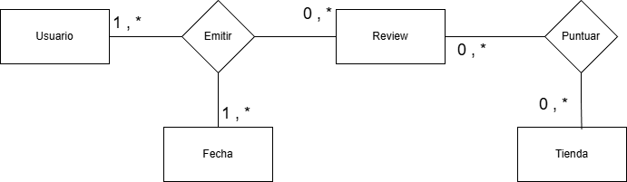

# Awesome Reviews API

## Resumen

La API que gestiona reseñas de productos realizadas por usuarios en tiendas específicas. Está compuesta por tres entidades principales: Review, User y Store. Cada reseña incluye información sobre el producto evaluado, la calificación otorgada, la fecha de la reseña y referencias al usuario y a la tienda correspondiente.

## Modelo conceptual

## Modelo lógico

## Catálogo de datos

### Review

| Campo     | Tipo de dato   | Restricciones | Clave | Descripción                                      |
|-----------|----------------|----------------|--------|--------------------------------------------------|
| id        | INT            | NOT NULL       | PK     | Identificador único de la reseña                |
| userId    | INT            | NOT NULL       | FK     | Referencia al usuario que escribió la reseña    |
| storeId   | INT            | NOT NULL       | FK     | Referencia a la tienda asociada a la reseña     |
| product   | VARCHAR        | NOT NULL       | —      | Nombre del producto reseñado                    |
| rating    | INT            | NOT NULL       | —      | Calificación
| date      | DATE           | NOT NULL       | —      | Fecha en que se realizó la reseña               |

### User

| Campo      | Tipo de dato   | Restricciones | Clave | Descripción                                      |
|------------|----------------|----------------|--------|--------------------------------------------------|
| id         | INT            | NOT NULL       | PK     | Identificador único del usuario                 |
| firstName  | VARCHAR        | NOT NULL       | —      | Nombre del usuario                              |
| lastName   | VARCHAR        | NOT NULL       | —      | Apellido del usuario                            |
| email      | VARCHAR        | NOT NULL, UNIQUE | —    | Correo electrónico del usuario                  |
| birthdate  | DATE           | NOT NULL       | —      | Fecha de nacimiento del usuario                 |

### Store

| Campo | Tipo de dato   | Restricciones | Clave | Descripción                      |
|-------|----------------|----------------|--------|----------------------------------|
| id    | INT            | NOT NULL       | PK     | Identificador único de la tienda|
| name  | VARCHAR        | NOT NULL       | —      | Nombre de la tienda              |
