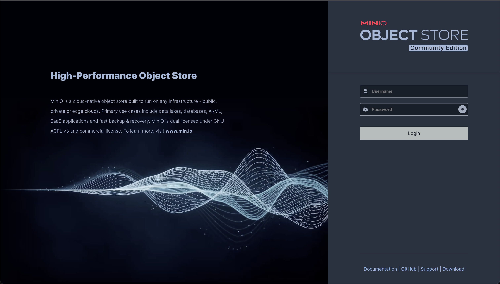
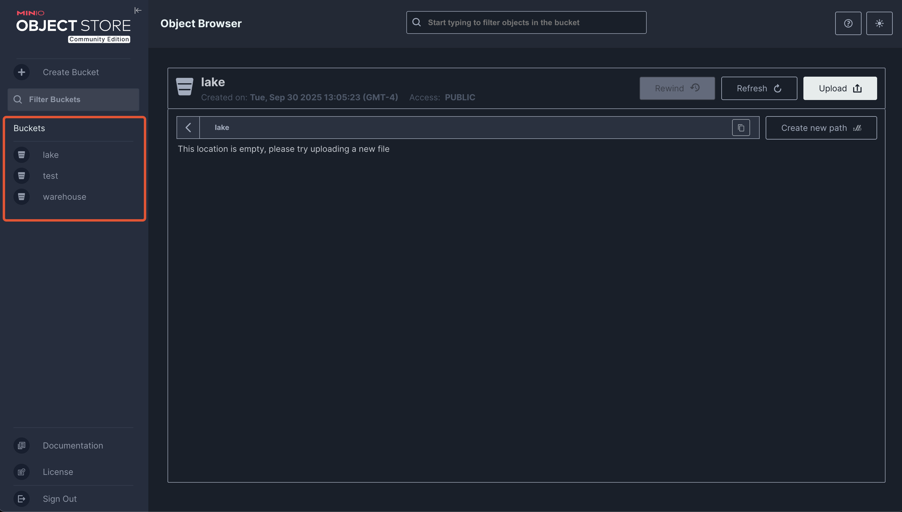
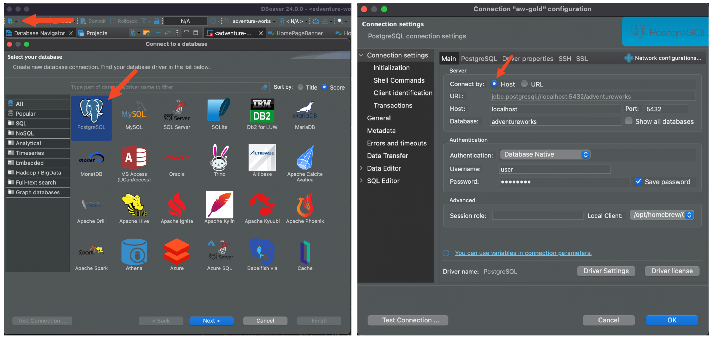
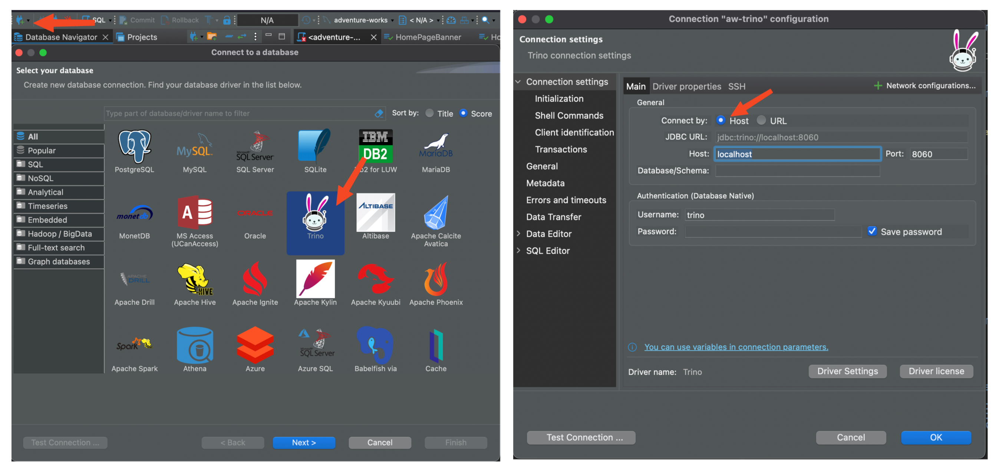
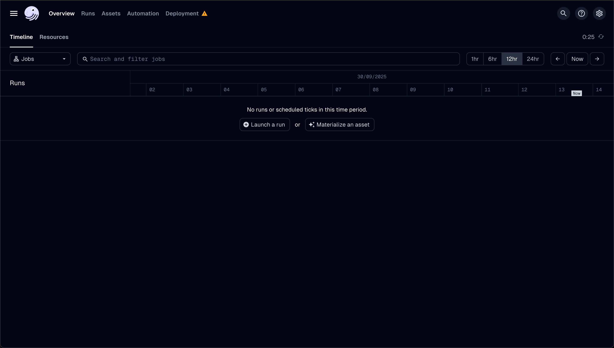

# Adventure Works DWH

Esta carpeta contiene el código para la implementación del Data Warehouse parte de la solución de Inteligencia de Negocios diseñada para el escenario de Adventure Works.

## Laboratorios

Los laboratorios impartidos en la asignatura están destinados a completar el código fuente de los distintos proyectos incluídos dentro del directorio `projects` los cuales serán:

- `dagster`: proyecto con el código fuente relevante para realizar la orquestación de los procesos ETL de la solución.
- `dbt`: proyecto con el código fuente relevante para realizar la transformación de los datos.
- `spark`: proyecto para el aprendizaje de Spark, así como muestras de código relevantes para el entendimiento de las tecnologías utilizadas en el proyecto.

## ¿Cómo desplegar el DWH?

### Configuración de tecnologías

Las configuraciones del DWH están incluídas en la carpeta `config` del directorio divididas en:

- `aio`: Configuración del contenedor de procesamiento  **a**ll-**i**n-**o**ne que incluye Spark, Dagster y Dbt. 
- `minio`: Configuración del almacenamiento de objetos
- `trino`: Configuración del motor de consultas federadas

> !! **No se recomienda modificar estas configuraciones sin un completo entendimiento del funcionamiento del sistema**

### Configuración de red

La configuración de la red de Docker en la cual se despliega el DWH se puede realizar modificando las variables de entorno del archivo `.env`. 

**Nótese que la red de Docker utilizada debe ser la misma red en la que se encuentran desplegadas las fuentes de datos**

### Despliegue

Para desplegar el DWH solo se necesitan ejecutar los siguientes comandos

```
docker compose -f storage.compose.yaml up -d
docker compose -f processing.compose.yaml up -d
```

Se recomienda esperar a que la capa de almacenamiento se haya terminado de desplegar antes de desplegar el contenedor de procesamiento

## ¿Cómo utilizar el DWH?

### Minio

Utilizar Minio es simple, basta con abrir el navegador en la dirección `localhost:${MINIO_ADMIN_PORT}`, por defecto `9000`, el cual nos lleva al administrador de objetos de Minio.



Las credenciales a utilizar para autenticarse son

- `Username`: `${MINIO_ROOT_USER}`
- `Password`: `${MINIO_ROOT_PASSWORD}`

Una vez autenticado compruebe que sean visibles los tres buckets a utilizar en este curso `test`, `lake` y `warehouse`, en el panel izquierdo del administrador.



### PostgreSQL

A la capa de oro del DWH almacenada en PostgreSQL se puede acceder utilizando DBeaver



La configuración sería

- Host: `localhost`
- Port: `${POSTGRES_PORT}`
- Database: `adventureworks`
- Username: `${POSTGRES_USER}`
- Password: `${POSTGRES_PASSWORD}`

### Trino

Para utilizar el motor de consultas federadas se puede usar DBeaver



La configuración sería

- Host: `localhost`
- Port: `${TRINO_HTTP_PORT}`
- Username: `trino`

Se deben de dejar los demás campos en blanco

### Dagster

Se puede acceder al panel de control de Dagster utilizando el buscador con la dirección `localhost:${DAGSTER_ADMIN_PORT}` 



### Jupyter 

El servidor de Jupyter Lab se puede acceder utilizando el buscador con la dirección `localhost:${JUPYTER_SERVER_PORT}` 


